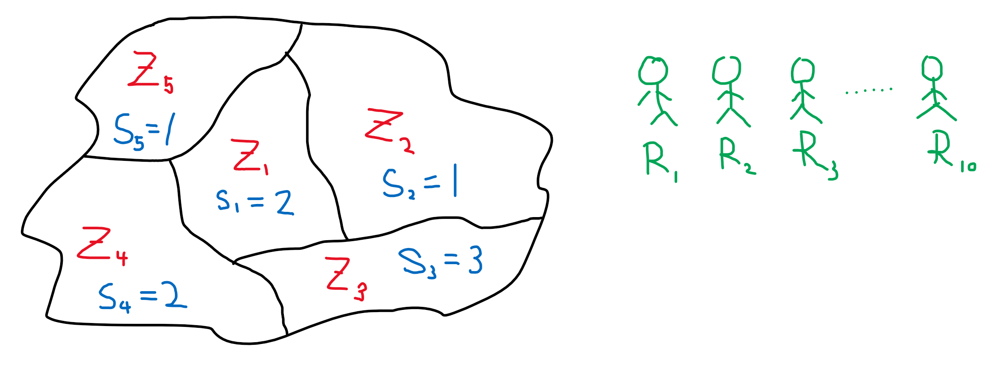

```{r setup, include=FALSE}
knitr::opts_chunk$set(echo = TRUE)
```

## Objectives

We want to allocate resources to zones while minimising the total cost (e.g. travel time, travel distance, expenditure, etc.) for the entire system.

## Allocation Costs

```{r}
I <- 10
J <- 5

my_costs <- matrix(runif(I*J), nrow = I, ncol = J)
rownames(my_costs) <- sprintf("R_%s", seq.int(from = 1,length.out = I))
colnames(my_costs) <- sprintf("Z_%s", seq.int(from = 1,length.out = J))

my_costs
```

This system has \(I=`r I`\) resources and \(J=`r J`\) zones, so that the resources are denoted as \(\{R_1, R_2, R_3...R_I\}\) while the zones are denoted as \(\{Z_1, Z_2, Z_3...Z_J\}\).

A \(I \times J\) matrix denoted as \(c\) represents the allocation cost for each resource to each zone. The value \(c_{i,j}\) represents the cost of assigning resource \(R_i\) to zone \(Z_j\). 

In this example, in order to assign resource \(R_2\) to zone \(Z_3\), a cost of \(c_{2,3}=`r round(my_costs[2,3],3)`\) is incurred.

## Minimum Capacity

```{r pressure, echo=FALSE, fig.cap="Map showing layout of the zones", out.width = '50%'}

```

```{r}
s <- c(2, 1, 3, 2, 1)
```

A integer vector \(s\) of length \(J\) will specify the minimum number of resources required for each zone. In this example, \(s_1=`r s[1]`\)  means that zone \(Z_1\) requires at least `r s[1]` resources.

## Problem Formulation

The Integer Programming (IP) problem is formulated as below. 

The symbol \(x\) denotes allocation matrix of size \(I \times J\), which is made up of binary values. When \(x_{ij}=1\), it indicates resource \(R_i\) is allocated to zone \(Z_j\). 

The constrains also specify that any resources can only be allocated to exactly \(1\) zone, and the total number of resources allocated to zone \(Z_j\) must equal to or exceeding the threshold value indicated by \(s_j\).

The objective function is a function which minimises the total cost \(z\) of the system.

\[
\begin{aligned}
& \text{Let} & I & = \text{No. of resources} \\
& & J & = \text{No. of zones} \\
& & x & = \text{Allocation matrix} \\
& & c & = \text{Cost matrix} \\
& & s & = \text{Minimum no. of resources} \\
\end{aligned}
\\
\\
\begin{aligned}
  & \text{Minimise} & z & = \sum_{i=1}^{I}\sum_{j=1}^{J}x_{ij}c_{ij} \\
  & \text{Subject to} & x_{ij} & \in \{{0,1\}} & \forall &i &=1,2,3,...,I \\
  &&&&& j &=1,2,3,...,J \\
  & & \sum_{j=1}^{J}x_{ij} & = 1 & \forall &i &=1,2,3,...,I \\
  & & \sum_{i=1}^{I}x_{ij} & \geq s_{j} & \forall &j &=1,2,3,...,J
\end{aligned}
\]

## Problem Solving

To solve the IP problem, load the following packages in `R`. We will solve this problem using the simplex algorithm.

```{r, message=FALSE, warning=FALSE}
library(dplyr)
library(ROI)
library(ROI.plugin.glpk)
library(ompr)
library(ompr.roi)
```

The IP problem is expressed in `R` in the following code chunk. The computation time is usually significantly longer in a complex, real-world problem.

```{r}

cost_func <- function(i,j){
  vapply(seq_along(i), function(k) my_costs[i[k], j[k]], numeric(1L))
}

model <- MILPModel() %>%
  add_variable(x[i, j], i = 1:I, j = 1:J, type = "binary") %>%
  add_constraint(sum_expr(x[i, j], j = 1:J) == 1, i = 1:I) %>%
  add_constraint(sum_expr(x[i, j], i = 1:I) >= s[j], j = 1:J) %>%
  set_objective(sum_expr(x[i, j] * colwise(cost_func(i,j)), i = 1:I, j = 1:J), sense = "min")

my_solution <-  model %>% 
  solve_model(with_ROI("glpk", verbose = TRUE))
```

Extracting the variable \(x_{i,j}\) will return the near-optimal allocation results.

```{r}
my_allocation_results <- my_solution %>%
  get_solution(x[i,j]) %>% 
  as_tibble() %>%
  filter(value == 1) %>%
  select(i, j) %>%
  arrange(i)

my_allocation_results
```

## Verifying the Solution

We can count the number of resources allocated to each zone, which is indicated in column `n` below. Compare that with the target threshold column `s`.

```{r}
my_allocation_results %>%
  group_by(j) %>%
  count() %>%
  ungroup() %>%
  arrange(j) %>%
  bind_cols(s = s)
```